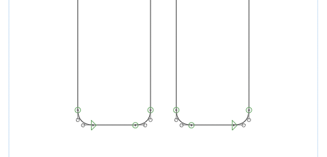
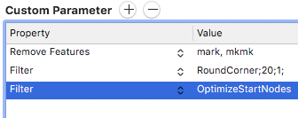

# Optimize Start Nodes
A filter for [Glyphs.app](https://glyphsapp.com/) that improves the position of each path’s start node.

You should take care to position your path start nodes so that they follow immediately after a straight line, if at all possible. Otherwise there will be a hidden line segment in your path. Positioning the start nodes correctly will make your data cleaner and save file size.



Left: start node after a curve; not optimal<br>
Right: start node after a line: better

You can also run the filter as a custom parameter, this is especially helpful as a post-processor for other filters like Round Corners, where you cannot control your start nodes in the design source directly.



Just paste this code into your instance custom parameters:

```
(
        {
        Filter = OptimizeStartNodes;
    }
)
```

N.B.: The result may not be visible when you open the exported font in Glyphs again, because Glyphs interprets the start node differently than what’s in the font.
